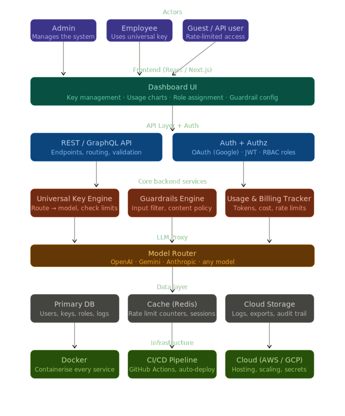
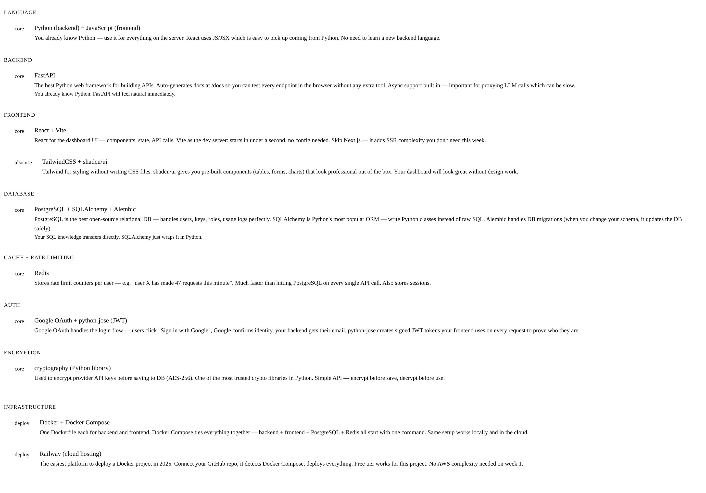
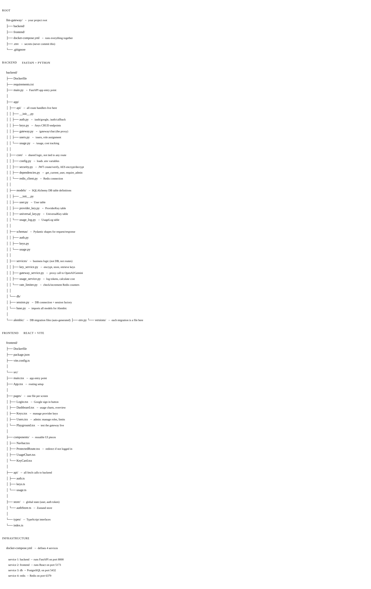
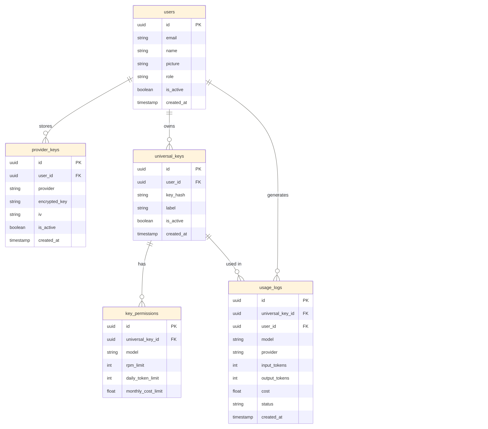
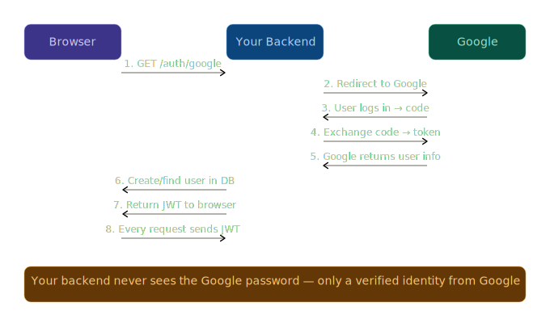
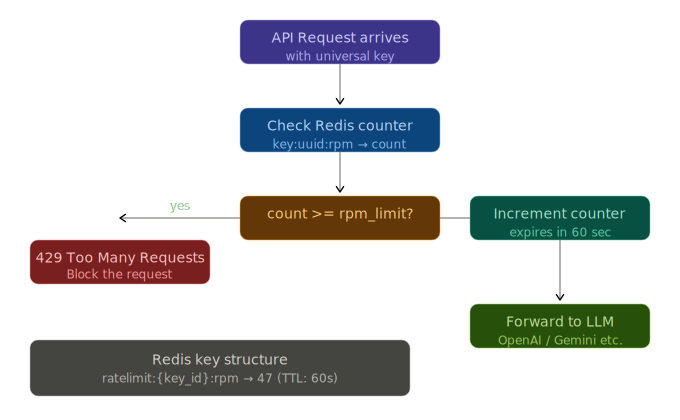
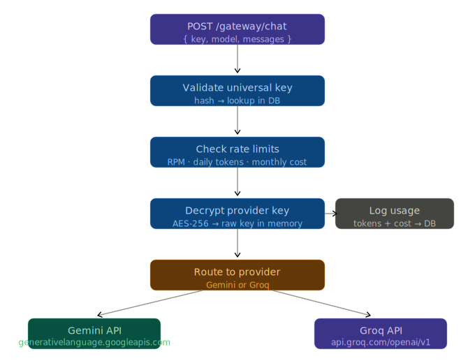
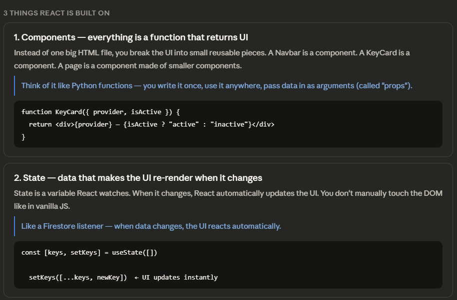
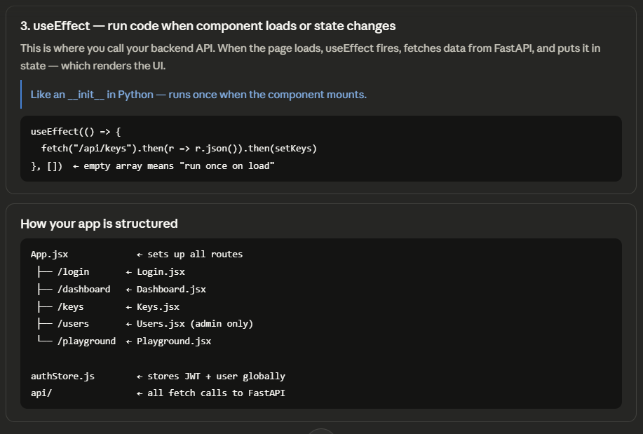

# LLM_Gateway

# Project Idea:

We are gonna build a LLM Gateway where users can store their own AI model API keys securely and get a universal key to access all these models safely ensuring no malicious inputs are passed using Guardrails. 

The main purpose of this project is to learn about the workings of Authentication, Authorization, Frontend, Backend, Database, Docker, API & Endpoint, Modularity of files along with Deployment.

# Projects Structure:



# Planning:

# Day 1
* Project setup + Auth
* Init repo, folder structure, pick stack (Node.js + Express + PostgreSQL + React)
* Google OAuth login · JWT generation · protect a route with middleware
* Basic user table in DB
* ⚠ Auth always takes longer than expected. Don't skip this — it's the foundation.

# Day 2
* Provider key management
* Frontend settings page · HTTPS POST to backend
* Encrypt key (AES-256) · Save to DB · Decrypt at use
* CRUD endpoints: add / update / delete a provider key

# Day 3
* Universal key + model routing
* Generate universal keys per user · Route request to correct provider
* Proxy call to OpenAI / Gemini using stored key
* Return response back to caller

# Day 4
* RBAC + Rate limiting
* Assign roles: Admin / Employee · Role-based middleware
* Rate limit per user using Redis counters (requests/min, cost/month)
* Admin can set limits per user from dashboard

# Day 5
* Usage tracking + Dashboard UI
* Log every API call: user · model · tokens · cost · timestamp
* Dashboard: usage charts per user, total spend, rate limit status
* Guardrails: basic input keyword filter (can expand later)

# Day 6
* Docker + local everything
* Dockerfile for backend · Dockerfile for frontend
* docker-compose with backend + frontend + PostgreSQL + Redis
* Make sure the full app runs with one command: docker compose up

# Day 7
* Deploy + wrap up
* Push to Railway / Render / Fly.io (easiest for first deploy)
* Set environment variables in cloud · point domain if you have one
* Smoke test every feature end-to-end

# Tech Stack



# File Stack



# DB Schema



* users — created automatically the first time someone logs in with Google. The role field is a string: "admin" or "employee". picture stores the Google profile photo URL for the dashboard.
* provider_keys — one row per provider per user. So if a user adds both OpenAI and Gemini, that's 2 rows. The raw key is never stored — only encrypted_key (AES-256 ciphertext) and iv (the initialization vector needed to decrypt it). These two together are what you need to reverse the encryption.
* universal_keys — the key your employees actually use in their apps. It maps back to the user who owns it. key_hash stores a hashed version of the key for fast lookup without storing it plain. A user can have multiple universal keys — one per project for example.
* key_permissions — this is where RBAC gets granular. Each universal key has its own limits: which models it can access, requests per minute, daily token budget, monthly cost cap. This is what makes your gateway powerful.
* usage_logs — every single API call through your gateway writes one row here. This is your audit trail, your billing data, and your analytics source all in one. Never delete from this table — it's append-only.


# Packages and its Uses for this Projects:

Package             Purpose
fastapi             The web framework
uvicorn             The server that runs FastAPI
sqlalchemy          ORM — talk to PostgreSQL in Python
alembic             DB migrations
psycopg2-binary     PostgreSQL driver (SQLAlchemy needs this)
python-dotenv       Load your .env file
cryptography        AES-256 encrypt/decrypt provider keys
python-jose         Create and verify JWT tokens
passlib             Password hashing utilities
httpx               Make async HTTP calls to OpenAI/Gemini

# Run Alembic to actually create these tables in your pgAdmin database: 
* Inside backend/ with venv activated (ensure .env file is inside) - This created a alembic folder inside backend.
alembic init alembic
* After changes in env.py run this - this is to create all the 5 tables in the DB.
alembic revision --autogenerate -m "initial tables"
alembic upgrade head

# What is happening in the Google Auth


# Get Google OAuth credentials:
Before writing code, you need to get your Google credentials. Do this first:

Go to console.cloud.google.com
Create a new project → name it llm-gateway
Go to APIs & Services → OAuth consent screen → choose External → fill in app name and your email
Go to APIs & Services → Credentials → Create Credentials → OAuth 2.0 Client ID
Choose Web application
Add http://localhost:8000 to Authorized origins
Add http://localhost:8000/auth/callback to Authorized redirect URIs
Copy the Client ID and Client Secret into your .env

# How RateLimiting Works


* Make sure Redis is running locally. If you don't have it installed:
* Windows — download from https://github.com/microsoftarchive/redis/releases
*  or run via Docker:
* docker run -d -p 6379:6379 redis

# Gateway Proxy Flow


# Evertime when logged in
0. The flow every time you restart:
1. Go to http://localhost:8000/auth/google
2. Log in with Google
3. Copy the token from the redirect URL
4. Paste it in the Authorize button in /docs
5. Now all your saved keys are accessible again

# Frontend Basics:



```
cd frontend
npm create vite@latest . -- --template react
```

```
npm install
npm install react-router-dom axios zustand
npm install -D tailwindcss postcss autoprefixer
npx tailwindcss init -p
```
```
npx shadcn@latest init

Component library: Radix
Preset: Nova
Base color: Slate
CSS variables: Yes
```

```
npx shadcn@latest add button card input label table badge tabs
```

```
npm install -D @types/node
npm install lucide-react recharts
```

# Docker Architecture:


# From llm-gateway/ root
docker compose up --build
```
First build takes 3-5 minutes (downloading images, installing packages). After that subsequent starts are fast.

You should see logs from all 4 containers streaming together. When you see:
```
llmgateway-backend  | INFO: Application startup complete.
llmgateway-frontend | VITE ready in 300ms

# Useful Docker commands to know:

### Start everything
docker compose up

### Start in background
docker compose up -d

### Stop everything
docker compose down

### Stop and delete all data (fresh start)
docker compose down -v

### See logs of one service
docker compose logs backend -f

### Restart just one service
docker compose restart backend

### Run a command inside a container
docker compose exec backend bash

### Stop but keep data
docker compose down

### Stop and delete all data (fresh start)
docker compose down -v