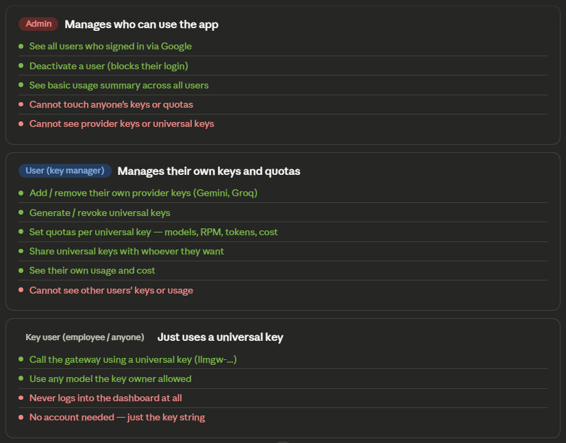
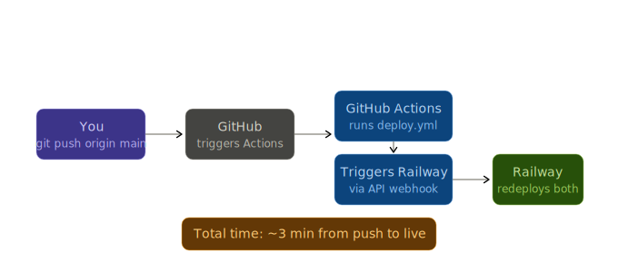

# LLM_Gateway

# Project Idea:

We are gonna build a LLM Gateway where users can store their own AI model API keys securely and get a universal key to access all these models safely ensuring no malicious inputs are passed using Guardrails.

The main purpose of this project is to learn about the workings of Authentication, Authorization, Frontend, Backend, Database, Docker, API & Endpoint, Modularity of files, Role Based Access Control, Quota-Based Access Control (QBAC) along with Deployment and CI/CD Pipeline.

# Projects Structure:


# Tech Stack:


# File Stack:
```
llm-gateway/
├── backend/
├── frontend/
├── docker-compose.yml← runs everything together
├── .env← secrets (never commit this)
└── .gitignore
```
```
backend/
├── Dockerfile
├── requirements.txt
├── main.py← FastAPI app entry point
│
├── app/
│ ├── api/← all route handlers live here
│ │ ├── __init__.py
│ │ ├── auth.py← /auth/google, /auth/callback
│ │ ├── keys.py← /keys CRUD endpoints
│ │ ├── gateway.py← /gateway/chat (the proxy)
│ │ ├── users.py← /users, role assignment
│ │ └── usage.py← /usage, cost tracking
│ │
│ ├── core/← shared logic, not tied to any route
│ │ ├── config.py← loads .env variables
│ │ ├── security.py← JWT create/verify, AES encrypt/decrypt
│ │ ├── dependencies.py← get_current_user, require_admin
│ │ └── redis_client.py← Redis connection
│ │
│ ├── models/← SQLAlchemy DB table definitions
│ │ ├── __init__.py
│ │ ├── user.py← User table
│ │ ├── provider_key.py← ProviderKey table
│ │ ├── universal_key.py← UniversalKey table
│ │ └── usage_log.py← UsageLog table
│ │
│ ├── schemas/← Pydantic shapes for request/response
│ │ ├── auth.py
│ │ ├── keys.py
│ │ └── usage.py
│ │
│ ├── services/← business logic (not DB, not routes)
│ │ ├── key_service.py← encrypt, store, retrieve keys
│ │ ├── gateway_service.py← proxy call to OpenAI/Gemini
│ │ ├── usage_service.py← log tokens, calculate cost
│ │ └── rate_limiter.py← check/increment Redis counters
│ │
│ └── db/
│ ├── session.py← DB connection + session factory
│ └── base.py← imports all models for Alembic
│
└── alembic/← DB migration files (auto-generated) ├── env.py └── versions/← each migration is a file here
```
```
frontend/
├── Dockerfile
├── package.json
├── vite.config.ts
│
└── src/
├── main.tsx← app entry point
├── App.tsx← routing setup
│
├── pages/← one file per screen
│ ├── Login.tsx← Google sign in button
│ ├── Dashboard.tsx← usage charts, overview
│ ├── Keys.tsx← manage provider keys
│ ├── Users.tsx← admin: manage roles, limits
│ └── Playground.tsx← test the gateway live
│
├── components/← reusable UI pieces
│ ├── Navbar.tsx
│ ├── ProtectedRoute.tsx← redirect if not logged in
│ ├── UsageChart.tsx
│ └── KeyCard.tsx
│
├── api/← all fetch calls to backend
│ ├── auth.ts
│ ├── keys.ts
│ └── usage.ts
│
├── store/← global state (user, auth token)
│ └── authStore.ts← Zustand store
│
└── types/← TypeScript interfaces
└── index.ts
```
```
docker-compose.yml← defines 4 services

service 1: backend → runs FastAPI on port 8000
service 2: frontend → runs React on port 5173
service 3: db → PostgreSQL on port 5432
service 4: redis → Redis on port 6379
```

# DB Schema:


* users - created automatically the first time someone logs in with Google. The role field is a string: "admin" or "employee". picture stores the Google profile photo URL for the dashboard.
  
* provider_keys - one row per provider per user. So if a user adds both OpenAI and Gemini, that's 2 rows. The raw key is never stored — only encrypted_key (AES-256 ciphertext) and iv (the initialization vector needed to decrypt it). These two together are what you need to reverse the encryption.

* universal_keys - the key your employees actually use in their apps. It maps back to the user who owns it. key_hash stores a hashed version of the key for fast lookup without storing it plain. A user can have multiple universal keys — one per project for example.

* key_permissions - this is where RBAC gets granular. Each universal key has its own limits: which models it can access, requests per minute, daily token budget, monthly cost cap. This is what makes your gateway powerful.

* usage_logs - every single API call through your gateway writes one row here. This is your audit trail, your billing data, and your analytics source all in one. Never delete from this table — it's append-only.

# Roles:



# Packages and its Uses for this Projects:

| Package           | Purpose                                             |
| ----------------- | --------------------------------------------------- |
| `fastapi`         | The web framework                                   |
| `uvicorn`         | The server that runs FastAPI                        |
| `sqlalchemy`      | ORM — interact with PostgreSQL using Python         |
| `alembic`         | Database migrations                                 |
| `psycopg2-binary` | PostgreSQL driver (required by SQLAlchemy)          |
| `python-dotenv`   | Loads environment variables from `.env` file        |
| `cryptography`    | AES-256 encryption/decryption for provider keys     |
| `python-jose`     | Create and verify JWT tokens                        |
| `passlib`         | Password hashing utilities                          |
| `httpx`           | Make async HTTP requests (e.g., OpenAI/Gemini APIs) |


# Run Alembic to create all tables in your pgAdmin database:
* Inside backend/ with venv activated (ensure .env file is inside) - This created a alembic folder inside backend.
```
alembic init alembic
```
* After changes in env.py run this - this is to create all the 5 tables in the DB.
```
alembic revision --autogenerate -m "initial tables"
alembic upgrade head
```

# What is happening in the Google Auth:


# Get Google OAuth credentials - Google OAuth Setup:

Before writing code, you need to get your Google credentials. Do this first:

### Step-by-Step Guide

1. Go to the Google Cloud Console:
   https://console.cloud.google.com

2. Create a new project:
   - Click **"Select Project" → "New Project"**  
   - Name it: `llm-gateway`  
   - Click **Create**

3. Configure OAuth Consent Screen:  
   - Navigate to **APIs & Services → OAuth consent screen**  
   - Choose **External**  
   - Fill in required details:
     - App Name
     - User Support Email
     - Developer Contact Email
   - Save and continue (you can skip optional scopes for now)

4. Create OAuth Credentials:
   - Go to **APIs & Services → Credentials**  
   - Click **Create Credentials → OAuth 2.0 Client ID**

5. Configure the OAuth Client::  
   - Application Type: **Web Application**
  
   - **Authorized JavaScript Origins:**
      http://localhost:8000
      
   - **Authorized Redirect URIs:**
      http://localhost:8000/auth/callback

6. Get Your Credentials:
   - After creation, copy:
     - **Client ID**
     - **Client Secret**

7. Add Credentials to `.env`:  
```env
GOOGLE_CLIENT_ID=your_client_id_here
GOOGLE_CLIENT_SECRET=your_client_secret_here
```

# How RateLimiting Works:


* Make sure Redis is running locally. If you don't have it installed:
* Windows — download from https://github.com/microsoftarchive/redis/releases
*  or run via Docker:
* docker run -d -p 6379:6379 redis

# Gateway Proxy Flow:


# Working in Swagger UI:
1. Go to http://localhost:8000/auth/google
2. Log in with Google
3. Copy the JWT token from the redirect URL
4. Paste it in the Authorize button in /docs
5. Now all services are accesible

# Frontend Basics:


# Frontend Setup:
```
cd frontend
npm create vite@latest . -- --template react
```

```
npm install
npm install react-router-dom axios zustand
npm install -D tailwindcss postcss autoprefixer
npx tailwindcss init -p
```
```
npx shadcn@latest init

Component library: Radix
Preset: Nova
Base color: Slate
CSS variables: Yes
```

```
npx shadcn@latest add button card input label table badge tabs
```

```
npm install -D @types/node
npm install lucide-react recharts
```

# Docker Architecture:


# To Run using Docker (Run below Command in llm-gateway/):
```
docker compose up --build
```

# Useful Docker commands to know:
```
- Start everything
    docker compose up

- Start in background
    docker compose up -d

- Stop everything
    docker compose down

- Stop and delete all data (fresh start)
    docker compose down -v

- See logs of one service
    docker compose logs backend -f

- Restart just one service
    docker compose restart backend

- Run a command inside a container
    docker compose exec backend bash

- Stop but keep data
    docker compose down

- Stop and delete all data (fresh start)
    docker compose down -v
```

# Deployment Architecture:


# CI/CD Pipeline Flow:


# Learning from this Project:

