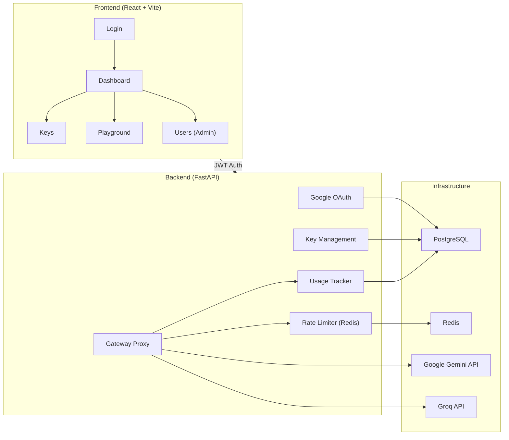
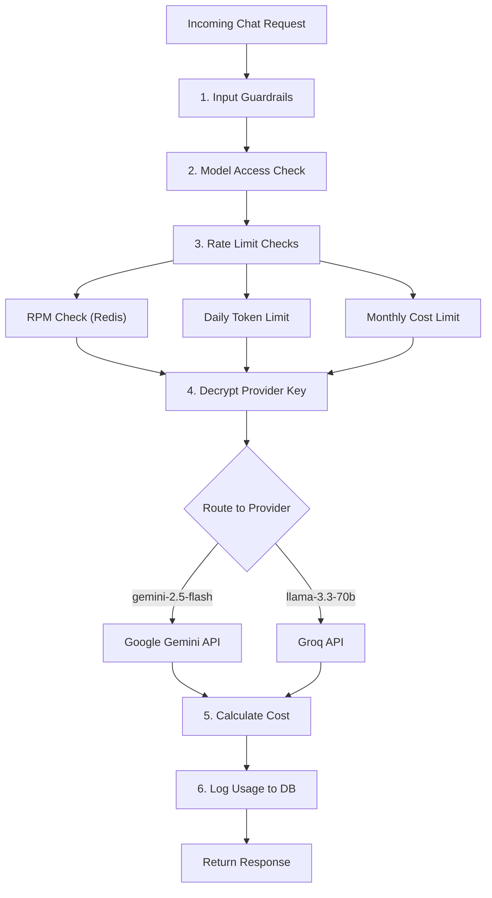
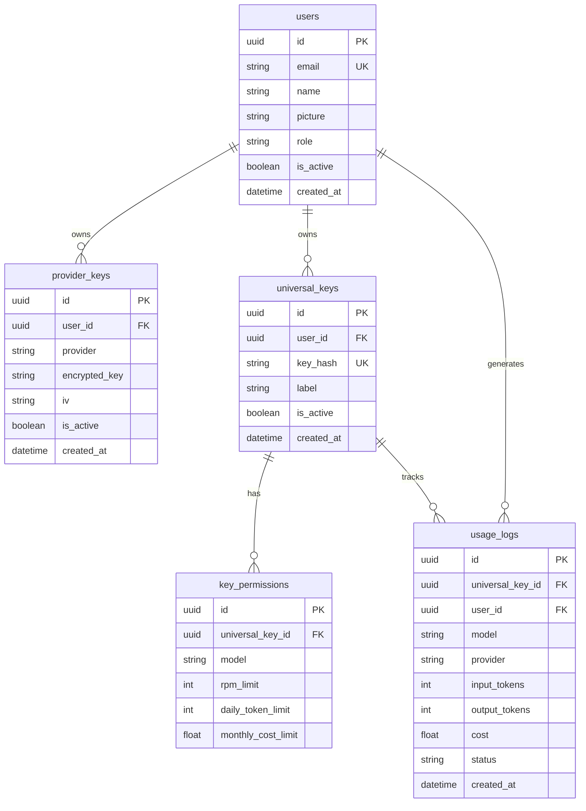
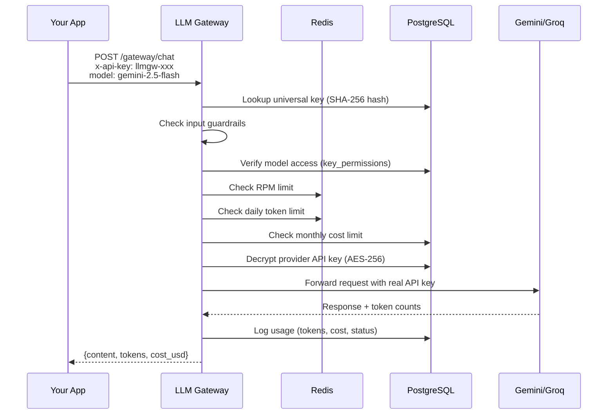

# LLM Gateway — Complete Project Analysis

## What This Project Does

**LLM Gateway** is a full-stack platform that lets users **securely store their AI provider API keys** (e.g., Gemini, Groq) and receive a **single universal key** to access all their models through one unified API. It acts as a **secure proxy** between your applications and LLM providers, with built-in **guardrails, rate limiting, cost tracking, and role-based access control**.

> [!TIP]
> Think of it like a **payment gateway for LLM APIs** — one key to rule them all, with full visibility and control.

---

## High-Level Architecture

---

## Tech Stack

| Layer | Technology |
|---|---|
| **Frontend** | React 18, Vite, Tailwind CSS, shadcn/ui, Zustand, Recharts, Lucide Icons |
| **Backend** | FastAPI, SQLAlchemy ORM, Pydantic, Alembic |
| **Database** | PostgreSQL (5 tables) |
| **Cache** | Redis (rate limiting counters) |
| **Auth** | Google OAuth 2.0 → JWT tokens |
| **Encryption** | AES-256-CBC (provider keys), SHA-256 (universal keys) |
| **LLM Providers** | Google Gemini, Groq |
| **Deployment** | Docker Compose, Railway, GitHub Actions CI/CD |

---

## Backend Deep Dive

### Entry Point — [main.py](file:///d:/GITHUB/LLM_Gateway/backend/main.py)
- Creates a FastAPI app and registers 5 routers: `auth`, [keys](file:///d:/GITHUB/LLM_Gateway/backend/app/services/key_service.py#47-52), [usage](file:///d:/GITHUB/LLM_Gateway/backend/app/services/usage_service.py#20-46), [gateway](file:///d:/GITHUB/LLM_Gateway/backend/app/services/gateway_service.py#151-205), [users](file:///d:/GITHUB/LLM_Gateway/backend/app/api/users.py#12-30)
- Adds `SessionMiddleware` (for OAuth redirect flow) and `CORSMiddleware` (for React frontend)

---

### API Routes

#### 1. Auth — [auth.py](file:///d:/GITHUB/LLM_Gateway/backend/app/api/auth.py)
| Endpoint | Method | Purpose |
|---|---|---|
| `/auth/google` | GET | Redirects user to Google OAuth consent screen |
| `/auth/callback` | GET | Handles Google callback, creates/finds user, issues JWT |
| `/auth/me` | GET | Returns current user profile from JWT token |

- First-time users auto-created with role `"employee"` (hardcoded admin email list)
- JWT token contains `sub` (email) and `role` claims

#### 2. Gateway — [gateway.py](file:///d:/GITHUB/LLM_Gateway/backend/app/api/gateway.py)
| Endpoint | Method | Purpose |
|---|---|---|
| `/gateway/chat` | POST | The core LLM proxy — accepts messages, routes to the right provider |

- Authenticates via `x-api-key` header (universal key), **not** JWT — designed for machine-to-machine calls

#### 3. Keys — [keys.py](file:///d:/GITHUB/LLM_Gateway/backend/app/api/keys.py)
| Endpoint | Method | Purpose |
|---|---|---|
| `/keys/provider` | POST/GET/DELETE | CRUD for provider API keys (encrypted at rest) |
| `/keys/universal` | POST/GET/DELETE | CRUD for universal keys (hashed, shown once at creation) |
| `/keys/universal/{id}/permissions` | POST/GET/DELETE | Set per-model quotas (RPM, daily tokens, monthly cost) |

#### 4. Users (Admin) — [users.py](file:///d:/GITHUB/LLM_Gateway/backend/app/api/users.py)
| Endpoint | Method | Purpose |
|---|---|---|
| `/admin/users` | GET | List all users (admin only) |
| `/admin/users/{id}/activate` | PATCH | Re-enable a user |
| `/admin/users/{id}/deactivate` | PATCH | Disable a user |
| `/admin/usage` | GET | Aggregated usage across all users |

#### 5. Usage — [usage.py](file:///d:/GITHUB/LLM_Gateway/backend/app/api/usage.py)
| Endpoint | Method | Purpose |
|---|---|---|
| `/usage/logs` | GET | Last 100 usage logs for current user |
| `/usage/summary` | GET | Monthly cost/token summary grouped by model |
| `/usage/admin/all` | GET | All logs (admin) |
| `/usage/admin/summary` | GET | Per-user aggregated summary (admin) |

---

### Core Services

#### Gateway Service — [gateway_service.py](file:///d:/GITHUB/LLM_Gateway/backend/app/services/gateway_service.py)

The heart of the system. The [process_gateway_request()](file:///d:/GITHUB/LLM_Gateway/backend/app/services/gateway_service.py#151-205) function executes this pipeline:

- **Guardrails**: Blocks prompt injection keywords ("ignore previous instructions", "jailbreak", etc.)
- **Supported Models**: `gemini-2.5-flash` → Gemini, `llama-3.3-70b-versatile` → Groq
- **Provider calls**: Each uses its respective SDK (google-genai, groq)

#### Key Service — [key_service.py](file:///d:/GITHUB/LLM_Gateway/backend/app/services/key_service.py)
- **Provider keys**: Encrypted with AES-256-CBC before storage, decrypted on-demand
- **Universal keys**: Generated as `llmgw-` + 32-char random token, stored as SHA-256 hash (raw key shown only once)
- **Permissions**: Granular per-model quotas on each universal key

#### Rate Limiter — [rate_limiter.py](file:///d:/GITHUB/LLM_Gateway/backend/app/services/rate_limiter.py)
Three independent checks run **before** every API call:

| Check | Storage | Window |
|---|---|---|
| Requests per Minute (RPM) | Redis counter (60s TTL) | 1 minute |
| Daily Token Limit | Redis counter (86400s TTL) | 24 hours |
| Monthly Cost Limit | SQL aggregate query | Calendar month |

#### Usage Service — [usage_service.py](file:///d:/GITHUB/LLM_Gateway/backend/app/services/usage_service.py)
- Logs every API call with tokens, cost, model, provider, and status
- Cost pricing table for each model (per 1K tokens)

---

### Security Layer — [security.py](file:///d:/GITHUB/LLM_Gateway/backend/app/core/security.py)

| Mechanism | Purpose | Details |
|---|---|---|
| **JWT** | Login sessions | HS256, 60-min expiry, signed with `SECRET_KEY` |
| **AES-256-CBC** | Provider key encryption | Random 16-byte IV per key, PKCS7 padding |
| **SHA-256** | Universal key hashing | Never store raw universal keys |

### Auth Dependencies — [dependencies.py](file:///d:/GITHUB/LLM_Gateway/backend/app/core/dependencies.py)
- [get_current_user](file:///d:/GITHUB/LLM_Gateway/backend/app/core/dependencies.py#14-37) — Extracts JWT from `Authorization: Bearer` header, validates, returns user
- [require_admin](file:///d:/GITHUB/LLM_Gateway/backend/app/core/dependencies.py#38-45) — Wraps [get_current_user](file:///d:/GITHUB/LLM_Gateway/backend/app/core/dependencies.py#14-37) + checks `role == "admin"`

---

### Database Schema (5 Tables)

---

## Frontend Deep Dive

### App Structure — [App.jsx](file:///d:/GITHUB/LLM_Gateway/frontend/src/App.jsx)
- React SPA with `react-router-dom` for routing
- Sidebar layout with navigation: Dashboard, Keys, Playground, Users (admin)
- [ProtectedRoute](file:///d:/GITHUB/LLM_Gateway/frontend/src/App.jsx#13-19) component redirects unauthenticated users to login
- Dark/light theme toggle via Zustand store

### Pages

| Page | File | Purpose |
|---|---|---|
| **Login** | [Login.jsx](file:///d:/GITHUB/LLM_Gateway/frontend/src/pages/Login.jsx) | Google OAuth sign-in button |
| **Auth Success** | [AuthSuccess.jsx](file:///d:/GITHUB/LLM_Gateway/frontend/src/pages/AuthSuccess.jsx) | Extracts JWT from redirect URL, stores in Zustand |
| **Dashboard** | [Dashboard.jsx](file:///d:/GITHUB/LLM_Gateway/frontend/src/pages/Dashboard.jsx) | Usage charts, cost overview, monthly summary |
| **Keys** | [Keys.jsx](file:///d:/GITHUB/LLM_Gateway/frontend/src/pages/Keys.jsx) | Full key management UI (provider keys, universal keys, permissions) |
| **Playground** | [Playground.jsx](file:///d:/GITHUB/LLM_Gateway/frontend/src/pages/Playground.jsx) | Live chat interface to test the gateway |
| **Users** | [Users.jsx](file:///d:/GITHUB/LLM_Gateway/frontend/src/pages/Users.jsx) | Admin: view, activate/deactivate users |

### State Management
- [authStore.js](file:///d:/GITHUB/LLM_Gateway/frontend/src/store/authStore.js) — JWT token, user profile, login/logout actions
- [themeStore.js](file:///d:/GITHUB/LLM_Gateway/frontend/src/store/themeStore.js) — Dark/light theme persistence

### API Client — [client.js](file:///d:/GITHUB/LLM_Gateway/frontend/src/api/client.js)
- Axios instance with base URL and JWT interceptor
- API modules: [auth.js](file:///d:/GITHUB/LLM_Gateway/frontend/src/api/auth.js), [keys.js](file:///d:/GITHUB/LLM_Gateway/frontend/src/api/keys.js), [gateway.js](file:///d:/GITHUB/LLM_Gateway/frontend/src/api/gateway.js), [usage.js](file:///d:/GITHUB/LLM_Gateway/frontend/src/api/usage.js), [users.js](file:///d:/GITHUB/LLM_Gateway/frontend/src/api/users.js)

---

## Deployment & Infrastructure

### Docker — [docker-compose.yml](file:///d:/GITHUB/LLM_Gateway/docker-compose.yml)
- **2 active services**: backend (FastAPI:8000), frontend (Vite:5173)
- DB and Redis services commented out (uses external hosted instances)

### CI/CD — [deploy.yml](file:///d:/GITHUB/LLM_Gateway/.github/workflows/deploy.yml)
- GitHub Actions workflow triggers on push to `main`
- Calls Railway's GraphQL API to redeploy backend first, then frontend
- Uses secrets: `RAILWAY_TOKEN`, `RAILWAY_BACKEND_ID`, `RAILWAY_FRONTEND_ID`

### Production URLs
- Backend: `https://llmgateway-production.up.railway.app`
- Frontend: `https://llmgateway-production-e66c.up.railway.app`

---

## Complete Request Flow Example

---

## Summary

This is a **production-grade, security-focused LLM management platform** that demonstrates:

- **Authentication**: Google OAuth → JWT with RBAC (admin/employee)
- **Encryption**: AES-256 for secrets at rest, SHA-256 hashing for lookup keys
- **API Security**: Input guardrails, rate limiting (RPM/tokens/cost), model access control
- **Multi-provider**: Unified interface across Gemini and Groq
- **Observability**: Per-call usage logging, monthly cost summaries, admin dashboards
- **Full-stack**: React frontend with modern UI, Zustand state, dark/light theme
- **DevOps**: Docker Compose, Railway deployment, GitHub Actions CI/CD
